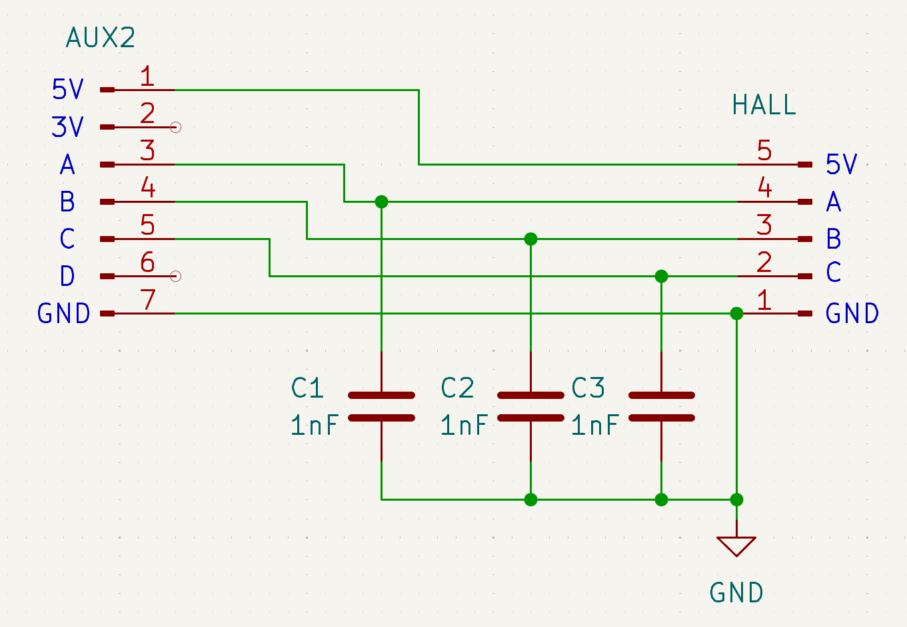

# Motor with Hall Effect Sensors

Many motors include hall effect sensors used to provide commutation information to motor controllers.  moteus is able to use hall effect sensors for both commutation and output positioning.  First, some caveats:

**They may not be needed**: Just because a motor has hall effect sensors built in, does not mean you need to use them.  If you can use the on-axis magnetic encoder integrated into moteus by mounting moteus appropriately relative to the rotor, that will always give better results than using hall effect encoders.

**You will likely need additional hardware**: Most configurations with hall effects will require additional filtering capacitors, placed near moteus, between each signal line and ground.  1nF is a recommended starting point.  They can be added either in the wire harness, or on unpopulated 0402 pads on the moteus-c1, moteus-n1, and moteus-x1.

**Hall effect sensors used for output positioning have very poor low velocity performance**: While hall effect sensors are minimally useful for commutation and higher speed output operation, they will provide poor performance when used as an output encoder at low speeds.  That means many position control applications, which are inherently often at low speed, will give poor results.

**moteus-r4 cannot easily drive many hall effect sensors**: moteus-r4 specifically has only 3.3V supply for external devices, whereas most hall effect encoders require 5V.  Further, the only means of connecting hall effect sensors to moteus-r4 are using unpopulated pads on the back of the board, and *not* using the onboard encoder.  Other moteus products do not have these specification limitations regarding supply voltage and connectors.

If using hall effects for commutation or output positioning is still desired, the below configurations can get you started.

## aux2 configuration ##

This configuration uses hall effect sensors connected to the aux2 GH7
connector for both commutation and output positioning.

moteus-c1 [(c1 pinout)](../reference/pinouts.md#moteus-c1), moteus-n1 [(n1 pinout)](../reference/pinouts.md#moteus-n1), and moteus-x1 [(x1 pinout)](../reference/pinouts.md#moteus-x1) all have an aux2 GH7 connector that can provide 5V output and has 5V tolerant IO pins.  The typical wiring diagram looks like the below, although the hall connector is "nominal" as there is no real standard:



As mentioned above, either 1nF capacitors should be installed in the harness between each signal line and ground, or installed on the appropriate unpopulated pads on the board.

The following aux2 configuration parameters should be set.

```
aux2.pins.0.mode 6  # hall
aux2.pins.0.pull 1  # pull_up
aux2.pins.1.mode 6  # hall
aux2.pins.1.pull 1  # pull_up
aux2.pins.2.mode 6  # hall
aux2.pins.2.pull 1  # pull_up
aux2.hall.enabled 1
```

Then motor_position is configured as follows:

```
motor_position.sources.0.aux_number 2
motor_position.sources.0.type 4  # hall
```

Finally, when calibrating, the number of poles is required to be
specified.

```
python -m moteus.moteus_tool -t 1 --calibrate --cal-motor-poles 30
```

## Advanced: Dual Encoder Setup

A more performant configuration may use the hall effect sensors for commutation and a different encoder measuring the output position.  That is not directly described here, but you can look at the [Dual Encoders](dual-encoders.md) guide as well as the [encoder reference](../reference/encoders.md) to understand how to configure it.
